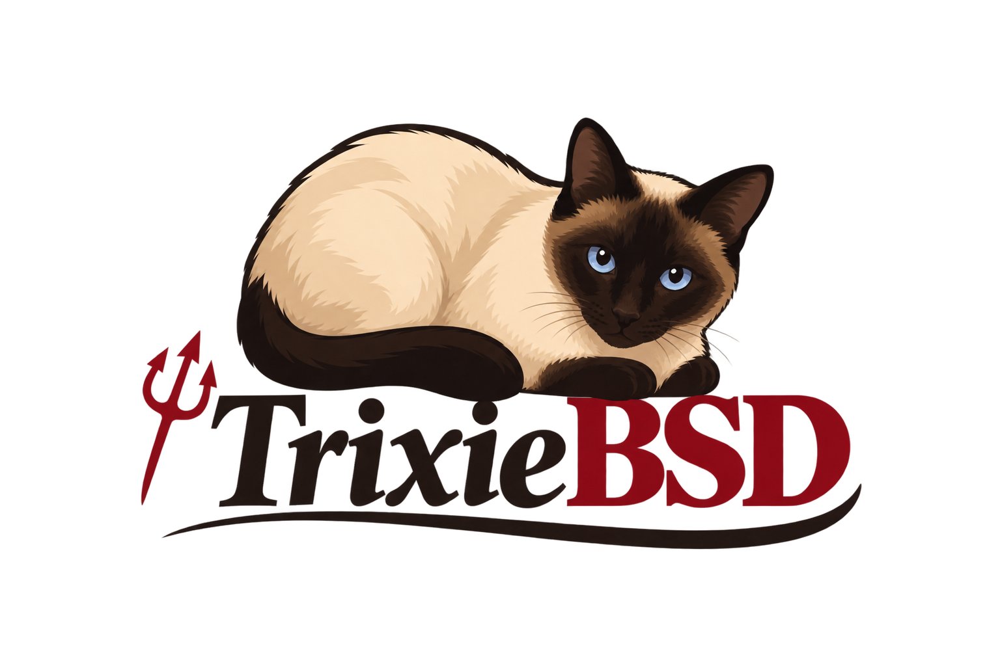

<p align="center">
  
</p>

<h1 align="center">TrixieBSD</h1>

<p align="center">
  A hobby Unix-like operating system in early development.
</p>

TrixieBSD is a personal hobby operating system project focused on
understanding how operating systems work from the ground up.

The project is currently in its **prototype stage**, with early userspace
utilities being developed while the architecture of the future system is
explored.

## Status

**Experimental / Prototype**

TrixieBSD is not currently a functional operating system. The existing code
is primarily experimental and educational, and the architecture is expected
to evolve significantly.

## Goals

The long-term goal is to build a small, Unix-like operating system while
learning and implementing its components from the ground up.

Areas of interest include:

- Kernel development
- Process management
- Memory management
- Filesystems
- System calls
- Device I/O
- C standard library
- Userspace utilities
- Unix/POSIX interfaces
- Shell and command-line environment

The project prioritizes understanding and simplicity over compatibility
with existing operating systems.

## Current Work

The project currently contains early userspace prototypes.

### `cat`

A minimal `cat`-like utility implemented using POSIX-style system calls:

- `open()`
- `read()`
- `write()`
- `close()`

The implementation also handles:

- Multiple input files
- Standard input
- EOF
- Read errors
- Write errors
- Partial writes
- Close errors
- Process exit status

## Project Structure

The project structure is currently evolving.

```text
TrixieBSD/
├── src/
│   └── cat.c
├── README.md
├── LICENSE
└── ...
